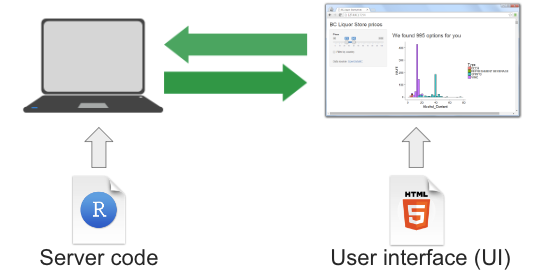

```{r setup, include = FALSE}
knitr::opts_chunk$set(fig.height = 6, 
                      warning = FALSE, 
                      message = FALSE, 
                      eval = FALSE)
```

:::::::::::::::::::::::::::::::::::::: questions 
- What is a Shiny App?
::::::::::::::::::::::::::::::::::::::::::::::::

::::::::::::::::::::::::::::::::::::: objectives
- Explain what a Shiny app can do.
- Demonstrate the basic building blocks of a Shiny app.
::::::::::::::::::::::::::::::::::::::::::::::::

## Introduction to Shiny

As researchers, we often want to make our work more accessible to a wider audience. While tools such as [Quarto] allow us to create rich static reports, they do not allow others to interact with our data and visualisations without learning R.

Shiny is an R package that makes it possible to build interactive web applications. These apps allow users to explore data, adjust inputs, and see results update in real time — without writing any R code themselves.

In this lesson, we introduce the basic structure of a Shiny app and begin building one step by step.

{alt='Diagram illustrating shiny components from Dean Attali's book'}

R Shiny apps are written in R code and consist of a user interface and the server. The **user interface** (ui) lets us create what the user will see and interact with. The **server** builds the outputs that react and update based on user inputs. Shiny apps run on an R process that serves content to a web browser. In practice, this may be a local R session, shinyapps.io, [Shiny Server], or RStudio Connect.

::::::::::::::::::::::::::::::::::::: discussion
Discussion: Example Shiny app websites

Shiny apps can range from simple interactive visualisations to complex applications used in production.

Take some time to explore these example apps built with Shiny.

- Posit [Shiny Gallery]. 
- 2024 Winners of the annual [R Shiny Competition].

- What do you like about them? 
- What do you not like about them? 
- What possibilities do you see for your own work?

:::::::::::::::::::::::::::::::::::::

## Creating a Shiny app

Let's start by creating a new project called `shiny-qcif`. Within that project, create a folder called data and download or move the lesson data into that folder. Next, create a new script called `app.R` and save it in the same directory as your `.Rproj` file.

::::::::::::::::::::::::::::::::::::: callout

Although you can put a Shiny app into any type of file initially, once you decide to use it with a [Shiny Server], it's important to note the server will only recognize one of two file configurations:

1) The entire app is contained within a file called `app.R` that is found in the top-level directory.

2) The app is split between `ui.R` and `server.R` files which have code relating to those two parts respectively.

If you do not follow one of these configurations, your app will not be recognized by the server and will not load.

This is not to say you cannot place **parts of your app's code** in different R files. You can do this using the `source()` function inside `app.R`, but we will return to this later.

::::::::::::::::::::::::::::::::::::: 

A Shiny project can be created in RStudio using the New Project Wizard and selecting `Shiny Application`. This creates a project with a pre-built Shiny app in an `app.R` script. While this is a quick way to get started once you are familiar with Shiny, here we will build the app from scratch so learners can see each part as it is introduced.

## The Anatomy of a Shiny app

A Shiny app has three essential parts: a ui, a server, and a call to shinyApp() that connects them. Most apps also include setup code at the top of the script to load packages and prepare data. Shown here together, code below will run and produce a blank app. We will introduce each part in turn and explain how they work.

```{r}
# 1. Setup
library(shiny)

# 2. Define a User Interface
ui <- fluidPage()

# 3. Define a server
server <- function(input, output) {}

# 4. Call shinyApp() to run your app
shinyApp(ui = ui, server = server)
```

::::::::::::::::::::::::::::::::::::: callout 
How do I actually run this?

Once you have saved your app in a file called `app.R`, you can run it in RStudio
by clicking the **Run App** button at the top of the editor, or by running the
script as you would any other R code.

When the app is running:
- A Shiny window will open showing your app
- Your R console will be busy while the app is active

To stop the app, click the **Stop** button in RStudio or close the Shiny window.

If you make changes to the code, stop the app first, then re‑run it to see the
updated version.
::::::::::::::::::::::::::::::::::::: 

First, **the setup**.

```{r}
# 1. Setup
library(shiny)
```

This code runs at the top of the app to load packages and to prepare objects - such as data or color palettes - that do not need to be created dynamically.

Second, **the User Interface**.

```{r}
# 2. Define a User Interface
ui <- fluidPage()
```

Here, we use the `fluidPage()` function to create an object called `ui` for later use. The function creates a fluid page layout — but what does that mean? 

Let us print the `ui` object for curiosity. You do not normally inspect UI objects directly when building apps.

```{r}
ui
```

Printing `ui` may look different depending on where you run it. In RStudio you may see a blank page, and in the lesson you may see no output. Both are expected: we have created the page layout, but it contains no visible elements yet.

Although the page looks empty, `fluidPage()` has actually generated HTML code. Shiny works by generating HTML in R and sending it to a web browser to be rendered.

To see the HTML directly, we can print it as text.

```{r}
cat(as.character(ui))
```

```output
<div class="container-fluid"></div>
```

This output shows the HTML that `fluidPage()` creates. The browser renders this HTML as a page, which is why we saw a blank layout instead of text.

At the moment, the page contains only a container. As we add elements to the UI, more HTML will be generated and rendered.

Note that the parentheses `()` tell us this is a function. Shiny user interfaces are built by combining functions that generate HTML. Nesting these functions results in nested HTML elements, which the browser renders as a page.

Third, we have **the server**:

```{r}
# 3. define a server
server <- function(input, output) {}
```

At this stage, the server is an empty function with two arguments: `input` and `output`. These are created by Shiny for us. The `input` object reflects values sent from the user interface, and the `output` object is where the server defines what the app will display.

The final part is the **call to Shiny**, which runs the app. This function takes the `ui` and `server` objects as arguments. Although these objects could be given different names, it is standard practice to call them `ui` and `server`.

```{r}
# 4. Call shinyApp() to run your app
shinyApp(ui = ui, server = server)
```

This final line runs the app by linking the `ui` and `server`.

Be sure to save the `app.R` script.

::::::::::::::::::::::::::::::::::::: keypoints 

- A Shiny app is an R program that generates interactive web content.
- A Shiny app has three required parts: a user interface, a server function, and a call that runs the app.
- The user interface defines what the app looks like, while the server defines how it behaves.
- Shiny works by generating HTML in R, which is rendered by a web browser.
     
::::::::::::::::::::::::::::::::::::::::::::::::

[Shiny]: https://shiny.posit.co/
[Quarto]: https://quarto.org/
[R Shiny Competition]: https://posit.co/blog/winners-of-the-2024-shiny-contest/
[Shiny Server]: https://posit.co/products/open-source/shinyserver/
[Shiny Gallery]: https://shiny.posit.co/r/gallery/