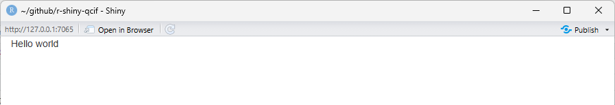
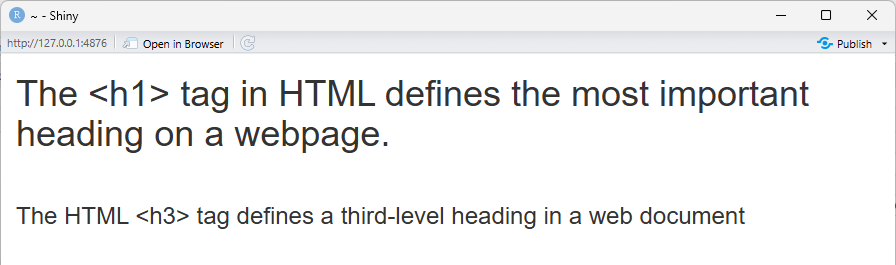

```{r setup, include = FALSE}
knitr::opts_chunk$set(fig.height = 8, 
                      warning = FALSE, 
                      message = FALSE,
                      eval = FALSE)
```

:::::::::::::::::::::::::::::::::::::: questions 
- How do we build a user interface in Shiny?
- How do we arrange inputs and outputs on a page?
::::::::::::::::::::::::::::::::::::::::::::::::

::::::::::::::::::::::::::::::::::::: objectives
- Add components to a Shiny user interface.
- Use layout functions to organise a user interface.
::::::::::::::::::::::::::::::::::::::::::::::::

Now that we understand the basic parts of a Shiny app, we will look more closely at the user interface (UI). In this episode, we will add elements to our basic app and learn how Shiny uses layout functions to arrange content on a page.

We will focus on adding generic text initially to understand how Shiny builds a page. Later, we will replace this text with inputs and outputs.

## Adding text to the UI

Starting with the blank app, we can add plain text inside the `fluidPage()`.

```{r}
# 2. Define a User Interface
ui <- fluidPage(
  "Hello world"                                       # this is new!
)
```

```output
{alt='Mostly blank white page displaying the text hello world'}

```

Any text placed in the UI is displayed on the page. Behind the scenes, Shiny is still generating HTML to describe that content.

```{r}
cat(as.character(ui))
```

```output
<div class="container-fluid">Hello world</div>
```
We can add text directly to the user interface in this way and let Shiny generate the HTML for us, or we can use a family of R functions that explicitly create HTML elements.

Let’s look at how to format text using Shiny’s UI functions.

## Formatting Text with UI Functions

Shiny UI elements can be created using R functions, many of which correspond to HTML tags. For example, the page below will have one big header (h1), a line break (br), and a smaller header (h3). Note how every element is separated by a comma.

```{r}
# 2. Define a User Interface
ui <- fluidPage(
  h1("The <h1> tag in HTML defines the most important heading on a webpage."),
  br(), # insert single line break
  h3("The HTML <h3> tag defines a third-level heading in a web document"),
)
```

{alt='Screenshot of app with different styles of html tags'}

In the rendered app, the text now appears with different visual emphasis. Although we are calling R functions, each of these function calls adds one corresponding HTML element to the page, which the browser then renders in the order they appear.

::::::::::::::::::::::::::::::::::::: callout
Tag exploration

Shiny provides functions for many HTML text elements.

 -Type `names(tags)` into the Console to see a list of HTML tag functions
 -Type `?tags` to get more information about each one, such as whether it takes any additional arguments.
::::::::::::::::::::::::::::::::::::: 

::::::::::::::::::::::::::::::::::::: challenge
Challenge: Add an additional element

Many HTML tags have corresponding Shiny functions. Choose one heading or paragraph‑style element (for example, h2(), h4(), or p()) and add it to the UI using a Shiny UI function.

::::::::::::::: solution

One possible solution is shown below. Your choice of heading or paragraph may differ.

```{r}
# 1. Setup
library(shiny)

# 2. Define a User Interface
ui <- fluidPage(
  h1("The <h1> tag in HTML defines the most important heading on a webpage."),
  br(), # insert single line break
  h3("The HTML <h3> tag defines a third-level heading in a web document"),
  h4("<h4> HTML example")
)

# 3. Define a server
server <- function(input, output) {}

# 4. Call shinyApp() to run your app
shinyApp(ui = ui, server = server)
```

:::::::::::::::
:::::::::::::::::::::::::::::::::::::

The functions we have just used are convenience wrappers around HTML tags. They allow us to add elements to the user interface in a simple, sequential way.

However, Shiny also provides higher‑level UI functions for common page elements that understand page structure and layout.

## Adding Layouts to the UI

Rather than hand-coding all of the HTML for a page, Shiny provides layout 
functions that create common interface structures for you.

Layout functions define the high‑level visual structure of an app. For example, a basic Shiny app often uses a sidebar layout, shown below.

{alt='Sidebar Layout from Mastering Shiny'}

To create this structure in our user interface, we start with a blank `fluidPage()` and add a title panel and a sidebar layout, which contains a sidebar panel and a main panel.

```{r}
# 2. Define a User Interface
ui <- fluidPage(
  titlePanel("This is the title panel"),
  sidebarLayout(
    sidebarPanel("This is the sidebar panel."),
    mainPanel("This is the main panel")
  )
)

```

Layout functions control the overall structure of the page, determining where content appears rather than what content is displayed.

::::::::::::::::::::::::::::::::::::: challenge
Challenge: Modify the layout content

Change the text inside the sidebar panel and the main panel to reflect what type of content you might place there in a real application.

::::::::::::::: solution

One possible solution is shown below. Your choice of content may differ.

```{r}
# 2. Define a User Interface
ui <- fluidPage(
  titlePanel("This is the title panel"),
  sidebarLayout(
    sidebarPanel("put inputs here"),
    mainPanel("put outputs here")
  )
)

```

:::::::::::::::
:::::::::::::::::::::::::::::::::::::

With the layout, or structure of the interface in place, we can now move on to adding inputs and outputs that allow users to interact with the app.

::::::::::::::::::::::::::::::::::::: keypoints 

- The user interface (UI) defines what appears in a Shiny app.
- UI elements are created using ordinary R functions provided by Shiny.
- Many UI functions generate HTML elements that are rendered by a web browser.
- Layout functions define the overall structure of the app, while other UI functions define the content placed within that structure.
     
::::::::::::::::::::::::::::::::::::::::::::::::

[layout ecosystem]: https://shiny.posit.co/r/articles/build/layout-guide/)
[much has been written]: https://mastering-shiny.org/action-layout.html
